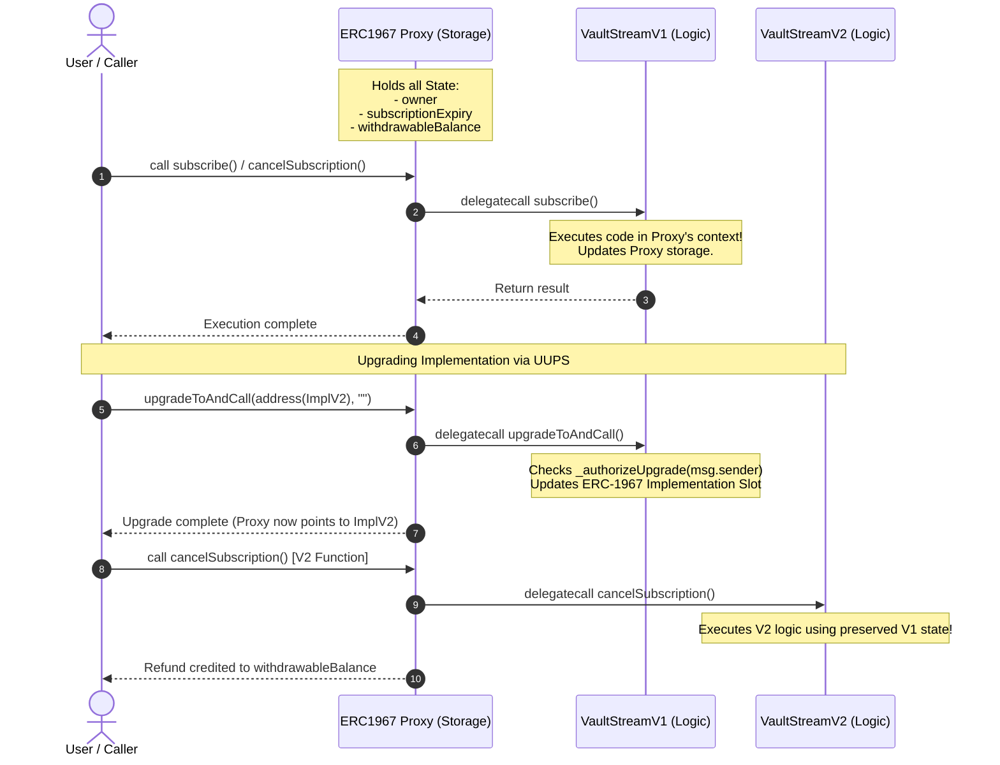
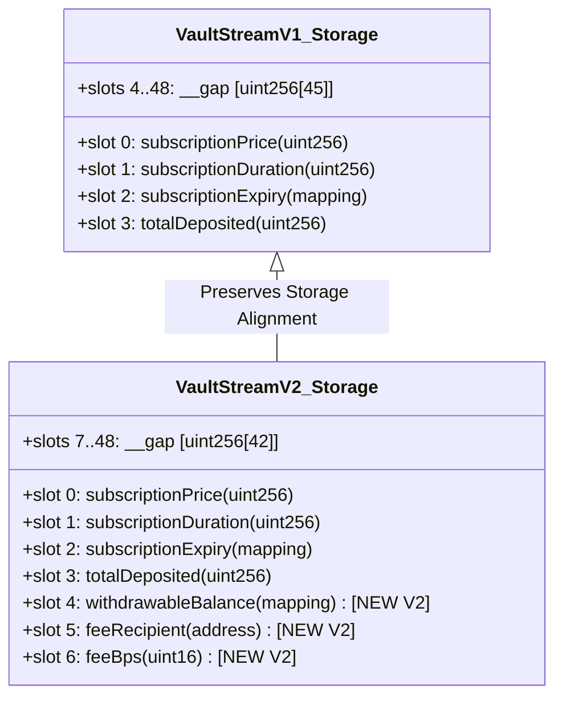

# VaultStream — UUPS Upgradeable Subscription Vault
**VaultStream** is a hands-on implementation of the **Universal Upgradeable Proxy Standard (UUPS / ERC-1967)** in Solidity. It demonstrates how to build, deploy, upgrade, and test upgradeable smart contracts safely without storage collisions or security vulnerabilities.

---

## Deployed Contracts (Sepolia Testnet)

| Contract | Address | Etherscan |
| :--- | :--- | :--- |
| **ERC1967 Proxy** | `0xe87F945f263B3fD5F78dd12C0c20ae6A401f0322` | [View Proxy on Etherscan](https://sepolia.etherscan.io/address/0xe87F945f263B3fD5F78dd12C0c20ae6A401f0322) |
| **VaultStreamV1 (Impl)** | `0x66Cf2317BF8291BD3494e82c30376192366D6D08` | [View V1 Impl on Etherscan](https://sepolia.etherscan.io/address/0x66Cf2317BF8291BD3494e82c30376192366D6D08) |
| **VaultStreamV2 (Impl)** | `0x67D13Ddc4d37dAae7847757d50fb5712DCe92568` | [View V2 Impl on Etherscan](https://sepolia.etherscan.io/address/0x67D13Ddc4d37dAae7847757d50fb5712DCe92568) |

---

## Core Architecture & UUPS Concept Deep Dive

### What is the UUPS Upgradeability Pattern?

In Ethereum, smart contract bytecode at a deployed address is immutable by default. To upgrade logic over time, proxy patterns separate **state storage** from **executable logic**.

Unlike the **Transparent Proxy Pattern** where upgrade logic lives inside the Proxy contract, **UUPS (ERC-1822 / ERC-1967)** places the upgrade function (`upgradeToAndCall`) inside the **Implementation contract itself**.



### Why UUPS over Transparent Proxy?
1. **Gas Efficiency**: The proxy contract is lightweight; fallback simply forwards all calls via `delegatecall` without inspecting function selectors for admin privileges.
2. **Smaller Deployment Footprint**: Upgrades are handled by the implementation logic.
3. **Security**: If a future implementation chooses to remove upgradeability, it can simply omit `_authorizeUpgrade`.

---

## Storage Safety & Storage Gap Alignment

Storage collision is the #1 security risk in proxy upgrades. Because state variables are stored in state slots sequentially starting at `slot 0`, **new state variables in V2 must be appended after V1 state variables**, and storage gaps must be adjusted accordingly.

### Storage Layout Shift (V1 $\rightarrow$ V2)



Notice:
$$\text{V1 Gap (45 slots)} = \text{3 New V2 State Variables} + \text{V2 Gap (42 slots)}$$

---

## Contract Specifications

### VaultStreamV1 (`src/VaultStreamV1.sol`)
- **`initialize(uint256 _price, uint256 _duration)`**: Replaces constructor for proxy initialization (`Initializable`, `OwnableUpgradeable`).
- **`subscribe()`**: Users deposit `subscriptionPrice` in ETH to receive active subscription access for `subscriptionDuration`.
  - If user is currently active, renewal extends from **`subscriptionExpiry[user] + duration`** (preserving full remaining duration).
- **`isActive(address user)`**: View function returning `true` if `subscriptionExpiry[user] > block.timestamp`.
- **`version()`**: Returns `1`.

### VaultStreamV2 (`src/VaultStreamV2.sol`)
Inherits and extends V1 logic with pro-rated cancellation and pull-payment withdrawals:
- **`setFeeRecipient(address _feeRecipient)`**: Sets address receiving early cancellation fee cut (Owner only, zero-address check).
- **`setFeeBps(uint16 _feeBps)`**: Configures fee percentage capped at **2000 BPS (20%)** (Owner only).
- **`cancelSubscription()`**:
  - Calculates pro-rated ETH refund based on unused subscription time:
    $$\text{refund} = \frac{\text{subscriptionPrice} \times \text{remainingTime}}{\text{subscriptionDuration}}$$
    $$\text{fee} = \frac{\text{refund} \times \text{feeBps}}{10\,000}$$
    $$\text{userRefund} = \text{refund} - \text{fee}$$
  - Resets `subscriptionExpiry[msg.sender] = 0`.
  - Credits `withdrawableBalance[msg.sender] += userRefund`.
  - Immediately forwards `fee` to `feeRecipient`.
- **`withdraw()`**: Pull-payment claim pattern. Transfers accumulated `withdrawableBalance` to `msg.sender` and clears balance to `0` first (Reentrancy safe).
- **`version()`**: Returns `2`.

---

## Testing Suite & Invariant Verification

The project includes unit, fuzz, integration, and invariant tests powered by **Foundry**.

```bash
Ran 6 test suites in 17.64s: 56 passed, 0 failed
```

### 1. Unit Tests (`test/unit/`)
- Payment validation (`VaultStream__IncorrectPayment`).
- Non-overlapping renewal calculations.
- Expiry boundary checks (`isActive`).
- Zero-address protection & fee cap validation ($> 2000$ BPS revert).
- Zero-balance withdrawal prevention (`VaultStream__NothingToWithdraw`).
- Re-entrancy and double-withdrawal prevention.
- Contract receiver ETH rejection fallbacks.

### 2. Fuzz Tests (`test/fuzz/`)
- **`testFuzz_SubscribeThenIsActive`**: Fuzzes active duration ($1 \text{ day} \le d \le 365 \text{ days}$).
- **`testFuzz_CancelRefundNeverExceedsPaid`**: Solvency fuzz invariant asserting pro-rated refund never exceeds paid price.
- **`testFuzz_FeeNeverExceedsCap`**: Fuzzes fee inputs up to `type(uint16).max` asserting strict enforcement of the 20% cap.

### 3. UUPS Upgrade Integration Tests (`test/integration/`)
- Deploys V1 via `DeployVaultStream.s.sol`.
- Creates real user subscriptions on V1.
- Upgrades live proxy to V2 implementation via `UpgradeVaultStream.s.sol`.
- **Verifies 100% state preservation** across upgrade: all active expiry timestamps, total deposited ETH, prices, and owner remain untouched.
- Executes V2 cancellation and pull-payment withdrawal on subscriptions originated in V1.

### 4. Stateful Invariant Testing (`test/invariant/`)
- Uses Foundry's **Handler Pattern** (`Handler.t.sol`) to execute 128,000 randomized state calls (`subscribe`, `cancelSubscription`, `withdraw`, `warpTime`).
- **Core Invariant Verified**:
  $$\text{address(VaultStream).balance} \ge \sum \text{withdrawableBalance}[user]$$

---

## Getting Started

### Prerequisites
- [Foundry / Forge](https://getfoundry.sh/)

### Installation & Build

```bash
git clone https://github.com/your-username/VaultStream.git
cd VaultStream

# Install dependencies
forge install

# Build contracts
forge build
```

### Running Tests

```bash
# Run all 56 unit, fuzz, upgrade & invariant tests
forge test -vv

# Run coverage report
forge coverage
```

---

## Deployment & Upgrade Scripts

```bash
# Deploy V1 Proxy on Sepolia
forge script script/DeployVaultStream.s.sol --rpc-url $SEPOLIA_RPC_URL --private-key $PRIVATE_KEY --broadcast --verify

# Upgrade Proxy to V2 on Sepolia
forge script script/UpgradeVaultStream.s.sol --rpc-url $SEPOLIA_RPC_URL --private-key $PRIVATE_KEY --broadcast --verify
```

---

## License
This project is licensed under the [MIT License](LICENSE).
